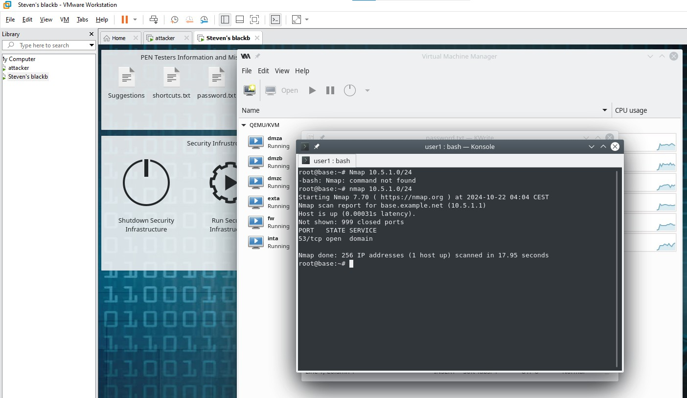
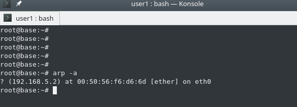
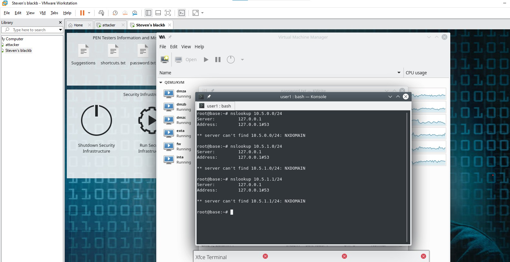
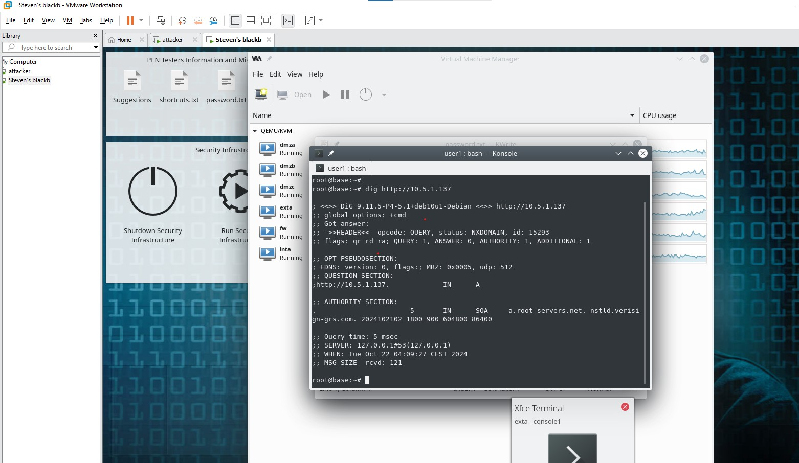
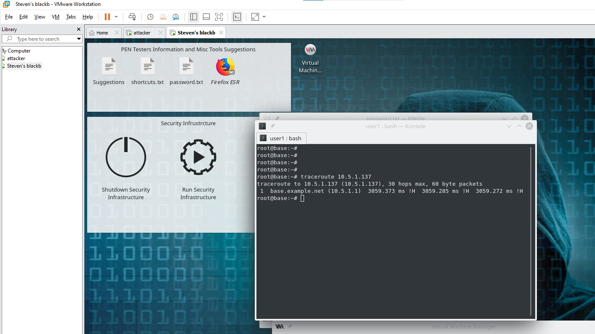
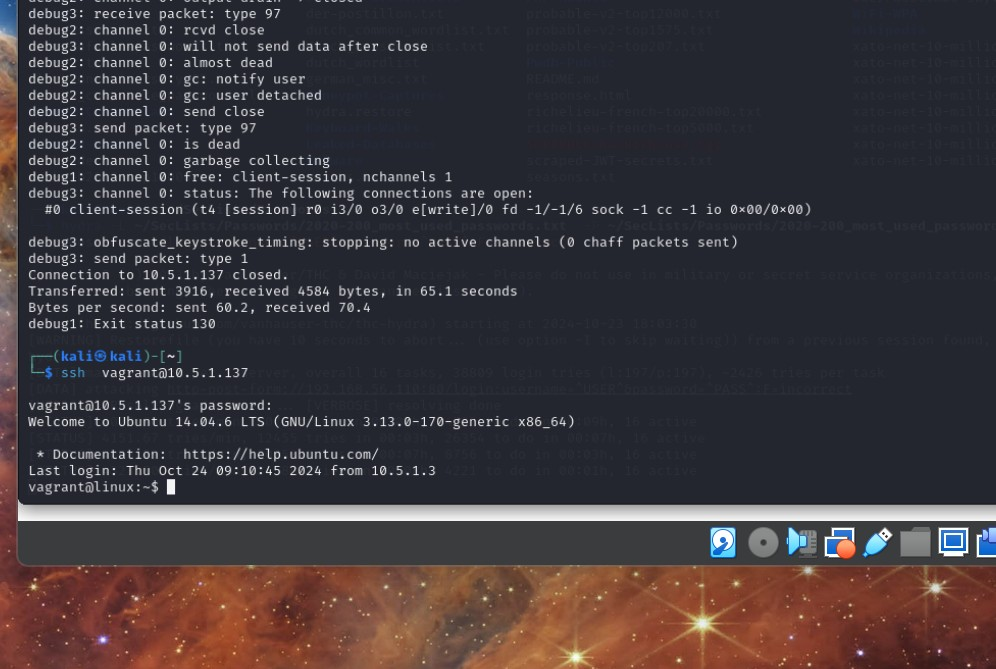

# 🛡️ DataTrust Penetration Testing Project  
*Full‑stack penetration test of a simulated enterprise environment*

---

## 📌 1. Project Overview

**Objective:**  
Conduct a full penetration test on DataTrust’s cloned environment, covering reconnaissance, enumeration, vulnerability identification, exploitation, and reporting.

**Scope:**  
- Internal network (10.5.x.x)  
- Apache web server  
- OpenSSH 6.6.1p1  
- phpMyAdmin  
- Honeypot systems  
- OWASP Juice Shop  

**Tools Used:**  
`Nmap`, `ARP`, `nslookup`, `dig`, `traceroute`, `Nikto`, `Hydra`, `BurpSuite`, `ZAP`, `Metasploit`, `Gobuster`, `Wfuzz`, `Python3 HTTP server`

---

# 🛰️ 2. Reconnaissance & Enumeration

## 🔍 2.1 Nmap Network Scan

**Screenshot:**  

**Findings:**  
- DNS service on port 53  
- Only one host active in the scanned range  

---

## 🔍 2.2 ARP Scan

**Screenshot:**  

**Findings:**  
- Device discovered at 192.168.5.2  
- MAC address successfully resolved  

---

## 🔍 2.3 DNS Enumeration (nslookup & dig)

**Screenshots:**  
  

**Findings:**  
- NXDOMAIN responses  
- No internal DNS records configured  

---

## 🔍 2.4 Traceroute

**Screenshot:**  

**Findings:**  
- Single hop to base.example.net  
- ICMP unreachable flags  

---

# ⚠️ 3. Vulnerability Identification

## 3.1 Nikto Scan — Apache Web Server

**Screenshots:**  
  

**Key Findings:**  
- Outdated Apache 2.4.7  
- Directory indexing enabled  
- Missing security headers  
- phpMyAdmin exposed  
- Multiple CVEs detected  

---

## 3.2 Nmap Service Enumeration

**Screenshot:**  

**Open Ports Identified:**

| Port | Service | Version |
|------|---------|---------|
| 21 | FTP | ProFTPD 1.3.5 |
| 22 | SSH | OpenSSH 6.6.1p1 |
| 80 | HTTP | Apache 2.4.7 |
| 3306 | MySQL | Unauthorized |
| 8080 | Jetty | 8.1.7 |

**Associated Vulnerabilities:**  
- CVE‑2016‑6515 (OpenSSH auth bypass)  
- CVE‑2015‑3306 (ProFTPD RCE)  
- CVE‑2020‑17530 (phpMyAdmin brute‑force)  

---

# 🎯 4. Exploitation Phase

## 4.1 SSH Brute‑Force (Hydra)

**Screenshot:**  

**Result:**  
- Successful login  
- Username: `vagrant`  
- Password: `vagrant`  

---

## 4.2 SSH Access Confirmation

**Screenshot:**  

**Result:**  
- Full shell access achieved  

---

## 4.3 Apache DoS (Slowloris)

**Screenshot:**  

**Result:**  
- Server vulnerable to partial‑request DoS  

---

## 4.4 phpMyAdmin Brute‑Force

**Screenshot:**  

**Result:**  
- Login vulnerable to brute‑force  
- No rate‑limiting or CAPTCHA  

---

# 🕳️ 5. Honeypot Exploitation

## 5.1 Directory Traversal (LFI)

**Screenshot:**  

**Result:**  
- `/etc/passwd` successfully extracted  

---

## 5.2 Reverse Shell Deployment

**Screenshots:**  
  

**Result:**  
- Remote shell access established  
- Full compromise of honeypot  

---

# 🧩 6. Web Application Attacks (OWASP Juice Shop)

**Screenshots:**  
  
  
  

**Vulnerabilities Demonstrated:**  
- DOM XSS  
- SQL injection → admin takeover  
- CAPTCHA bypass  
- Sensitive data exposure  
- Broken authentication  

---

# 🛡️ 7. Summary of Findings

### **Critical Vulnerabilities**
- OpenSSH authentication bypass  
- Apache Slowloris DoS  
- phpMyAdmin brute‑force  
- LFI → RFI → reverse shell  
- SQL injection → admin takeover  
- Weak password policy  
- Missing security headers  
- Directory indexing  

### **Impact:**  
- Full system compromise  
- Credential exposure  
- Remote code execution  
- Administrative access to web apps  
- Sensitive data disclosure  

---

# 🔧 8. Recommendations

- Enforce MFA on SSH and admin portals  
- Patch Apache, OpenSSH, ProFTPD  
- Disable directory indexing  
- Implement rate‑limiting & CAPTCHA  
- Restrict phpMyAdmin to internal IPs  
- Harden firewall rules  
- Deploy IDS/IPS monitoring  
- Enforce strong password policies  

---

# ✔ End of Case Study 1